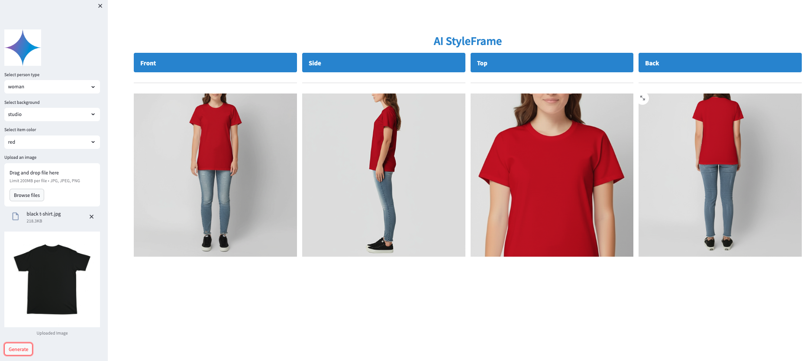

# Introduction  

Imagine uploading a single photo of your product — a t-shirt, dress, or suit — and instantly generating a rich portfolio of AI-driven model shots in diverse settings, poses, and styles. Powered by Gemini, AI StyleFrame transforms one image into a curated showcase, helping designers, retailers, and creators visualize their product across demographics, moods, and markets — without the cost of a photoshoot.

# Details

You can load the image of a clothing item (e.g. t-shirt, dress, skirt). Then you can select what type of person you want to show dressed with the item:
- girl
- boy
- man
- woman
Another element that you can configure is the background:
- studio
- nature
- city
Next, you can also select the item color:
- unchanged (from the clothing item loaded)
- black
- darkblue
- blue
- red
- green
- grey

By pressing the button `Generate`, the `Gemini` model is prompted to generate a sequence of images, by modifying the uploaded clothing item:
- assign the selected color
- use an image background as specified
- dress the person type as selected with the clothing item
The image is further specialized to show full body frontally, from the side, the upper body (torso) only, and from the back. Therefore 4 images are generated, as shown in the below example:



# Development 

The application is developed using Python. The user interface is developed using Streamlit.  

The application is deployed with App Engine.


# Deployment using Google Cloud SDK


To init the Google Cloud SDK, run the command:

```~/google-cloud-sdk/bin/gcloud init```

See the list of projects with:

```~/google-cloud-sdk/bin/gcloud projects list```

Check what project is set:

```~/google-cloud-sdk/bin/gcloud config get-value project```


To set the current project, run:

```~/google-cloud-sdk/bin/gcloud config set project <PROJECT_NUMBER>```


To deploy  the application, run the command:

```~/google-cloud-sdk/bin/gcloud app deploy app.yaml --project <PROJECT_ID>```

**Important note**: you will have to deploy the application in a region where the Gemini model version used is available.

# Start app

To start the application, run from the root:

```streamlit run --server.port 8080 --server.enableCORS false --server.enableXsrfProtection=false --server.enableWebsocketCompression=false app.py```

On local, if you want to test the app, just run:

```streamlit run app.py```